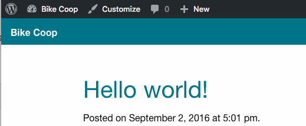

# bike-coop

## About

We are rebuilding the Fort Collins Bike Coop website currently. Our objective is to make it mobile friendly and add in a form to enable users to submit Volunteer Applications and Report Stolen Bikes.

This repository exists as a central place to share resources and instructions. The actual code is split into several separate repos:

- [The central repository for the project is located here.](https://github.com/CodeForFoco/bike-coop)
- [The code for the project theme is located here.](https://github.com/CodeForFoco/bike-coop-theme)
- [The code for the project plugin is located here.](https://github.com/CodeForFoco/bike-coop-plugin)

## Easy Getting Started

1. Sign up for [Cloud 9](https://c9.io/).
	a. Create new workspace, of type `Wordpress`
   		name: `bike-coop-c9`
   		description: `wordpress bike-coop workspace`
2. Use or setup a local web development environment
	a. Pre-configured installers:
		[XAMPP][XAMPP]
		[MAMP][MAMP]
	b. Custom setups:
		[Windows][windowsServerSetup]
		[OSX][osxServerSetup]
1. Open up a terminal.
1. `cd ~/workspace/wp-content/plugins/`
1. `git clone https://github.com/CodeForFoco/bike-coop-plugin`
1. `cd ~/workspace/wp-content/themes/`
1. `git clone https://github.com/CodeForFoco/bike-coop-theme`
1. `cd bike-coop-theme/`
1. `npm install`
   - `npm` command installs all pieces of theme and it takes a LONG time to complete. If it's interrupted, you will need to remove `node_modules/` subdirectory in order to re-run it. When completed, the last line will look something like `bower@1.6.9 node_modules/bower` and you'll get a terminal prompt.
1. Click `Run Project`, found in the menubar on the page.
   - Open the Wordpress site at the link given, and walk through the Wordpress setup.
      - in the `Welcome` form, Site Title, Username, Password, and Email are for the new site you are creating.
      - You'll need to login with newly created credentials to complete Wordpress setup
1. Activate Bike Coop theme from `Appearance -> Themes` sidebar item. It might be called `FoundationPress` in the preview grid.
1. Activate `Bike Coop Site Plugin` from `Plugins` sidebar item.
1. View site. Congrats! You have the Wordpress site up.

## Contributing

We welcome new contributors. Not sure where to start? Check for any [open issues][githubissue] or ping the team on [our slack channel](https://codeforfoco.slack.com/).

### Code (Theme, Plugin, Etc.)

Ensure your code follows best practices and adheres to good style.

Be sure to read our in depth guide on [contributing][contributing], which includes instructions on how to fork, clone, branch, commit, pull request and sync your fork.

TL;DR Contribution Workflow:

1. [Fork](https://help.github.com/articles/fork-a-repo/) this repository and clone your fork.
1. Make a patch branch.
1. Make changes, commit, and push.
1. Submit a pull request and your changes will be reviewed and merged.

### WordPress Content

If you would like to contribute/migrate non-code website content, you can do so via our [temporary development site][wpdevsite]. Server info including credentials are available as a pinned document on our #development Slack channel (see Jordan for access to Slack). All content creation inside of WP should be done through individual WP accounts; please only use the 'cffc' master account to create your own individual account with whatever privileges you need.  This takes full advantage of the built-in WP content versioning and permissions and allows us to know who changed what outside of Git.

For those unfamiliar with adding a WordPress page, please read [some basics][wppagebasics].

[contributing]: https://github.com/CodeForFoco/org/blob/master/CONTRIBUTING.md
[trello]: https://trello.com/b/Zrj0doO2/fort-collins-bike-co-op
[githubissue]: https://github.com/CodeForFoco/bike-coop/issues
[wpdevsite]: http://198.58.102.79/wp-admin
[wppagebasics]: https://codex.wordpress.org/Pages_Add_New_Screen
[xampp]: https://www.apachefriends.org/download.html
[mamp]: https://www.mamp.info/en/downloads/
[windowsServerSetup]: https://eksith.wordpress.com/2010/11/07/nginx-php-mysql-windows/
[osxServerSetup]: https://coolestguidesontheplanet.com/get-apache-mysql-php-and-phpmyadmin-working-on-osx-10-11-el-capitan/
